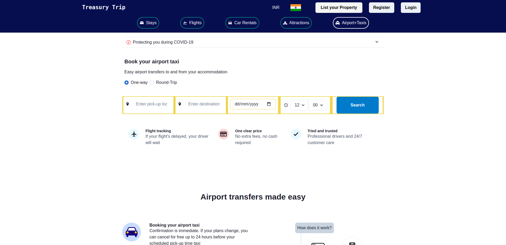

# Treasury Trip

:point_right: Visit the deployed website [here](https://treasury-trip.netlify.app)

## Collaborators

1. [Shreedhar Hegde](https://github.com/shreedharhegde99)
2. [Sandeep Gond](https://github.com/Sandeepgond)
3. [Rajesh Byagalwar](https://github.com/rajeshbyaga)
4. [Shivam Moudgil](https://github.com/Shivam-Moudgil)
5. [Farman Malik](https://github.com/farmanfirnas)

## Tech Stacks

- React
- Chakra UI
- NodeJS
- Express
- MongoDB

## 1. Dashboard

 

## 2. Flights page

 

## 3. Attractions page

 

## 4. Airport Taxi page

 

## 5. Register page

 

## 6. Login page

 

